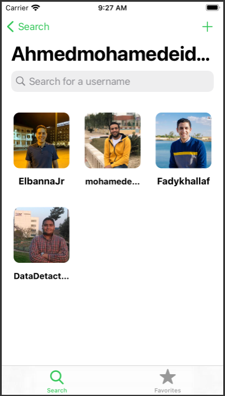
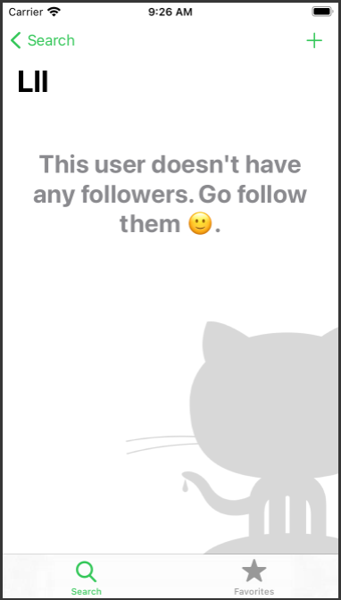
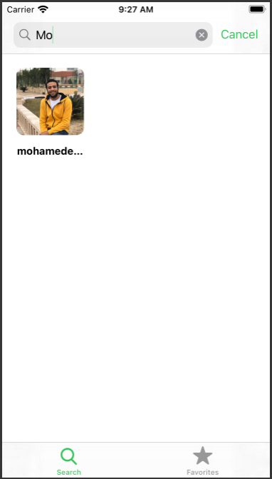
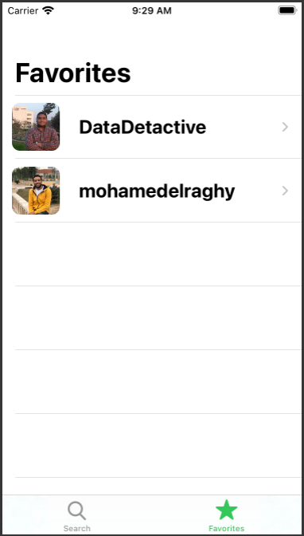

# GithubFollowers-IOS13

### Requirements:
> Xcode 12 or later  
> Swift 5

### about: 
RESTful API-based app where user can get the followers list for any username and additional information about each follower, also there is ability to add any follower to the favorite list and can open the github page for any follower on safari browser.
 

    
  
  
  
   
  
  
  
  

